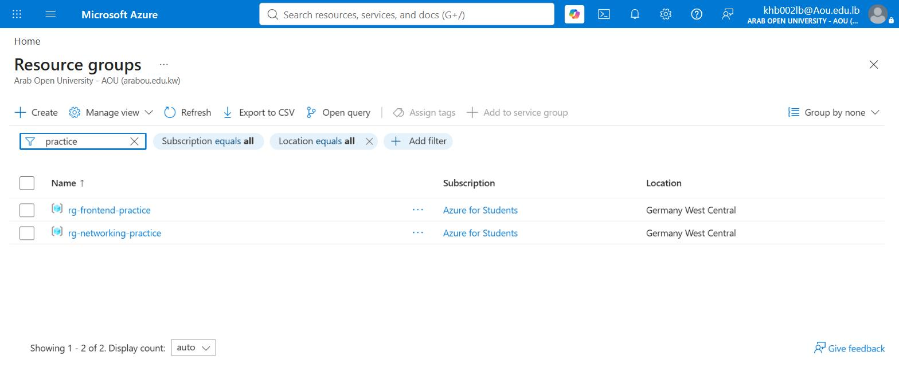

# Azure Terraform Practice — Networking & App Service

Infrastructure-as-Code exercise: provisioning multiple connected Azure
resource groups from scratch with Terraform, run through Azure Cloud Shell.
Goal was to go beyond "one resource in one file" and build resources that
actually reference and depend on each other, the way a real environment
would.

## Architecture

```
rg-networking-practice (Germany West Central)
└── vnet-practice 10.0.0.0/16
    └── snet-frontend 10.0.1.0/24

rg-frontend-practice (Germany West Central)
└── asp-shipping-frontend  Linux Service Plan, B1, Italy North
    └── app-shipping-frontend  Linux Web App, Node 20-lts
```



Resource groups, the virtual network, and the subnet are built with
`resource` blocks Terraform fully owns. Downstream resources reference
`azurerm_resource_group.rg1.location` / `.name` rather than hardcoded
strings, so everything stays consistent if a region or name changes
upstream.

## Provisioning errors hit and resolved (6)

Every one of these came from an actual `terraform plan`/`apply` run, not
simulated — Terraform's error output was used to diagnose each one before
changing anything.

1. **"Reference to undeclared input variable"** — `variables.tf` and
   `outputs.tf` had been saved outside the actual Terraform working
   directory. Fixed by recreating both files inside the correct folder.
2. **Cloud Shell `StorageFull` (90% of 5GB used)** — unrelated old VS Code
   server versions were eating persistent storage. Cleared 3.4GB and
   resumed work without losing state.
3. **`azurerm_static_web_app` blocked with `403 RequestDisallowedByAzure`**
   — the subscription had a region policy blocking Static Web Apps in West
   Europe. Pivoted to a Linux App Service instead of fighting the policy.
4. **`sku_name = "F1"` rejected with a 401 quota error** ("Current Limit
   (F1 VMs): 0") — the subscription had zero free-tier quota available.
   Switched to the paid `B1` tier.
5. **`always_on cannot be true with F1`** — turned out to be a stale file
   that hadn't actually saved the SKU change yet. Caught by re-checking the
   file contents rather than assuming the error was still accurate.
6. **`node_version = "22-lts"` rejected** — the `azurerm` provider was
   pinned at `~> 3.0`, which only validates Node runtimes up to `20-lts`.
   Reverted to `20-lts` rather than blindly bumping the provider version
   mid-exercise.

## Stack

Terraform · Azure Resource Groups · Virtual Network · Subnet · App Service
Plan · Linux Web App · Azure Cloud Shell

## Notes

Built and applied via Azure Cloud Shell (browser-based Terraform, already
authenticated to Azure) rather than a local CLI login, due to an
organizational tenant restriction on the local Azure CLI app.
